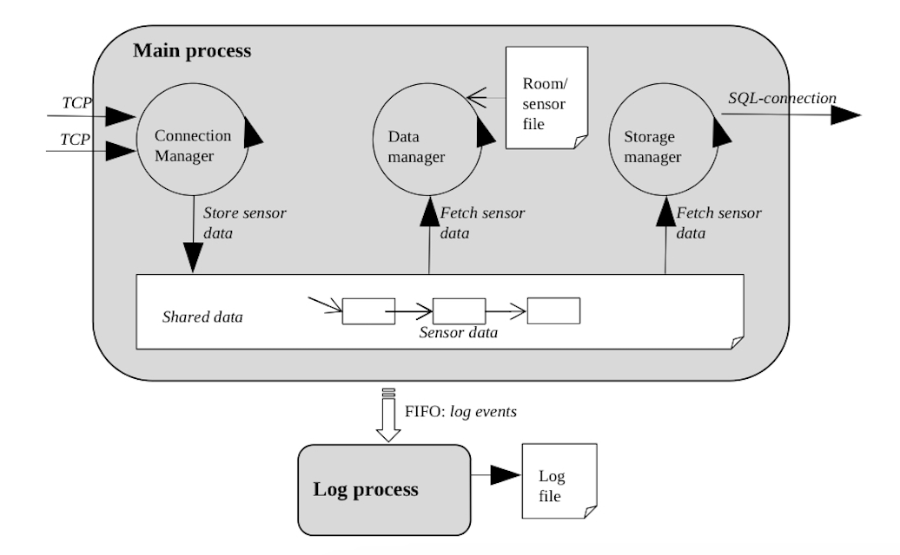
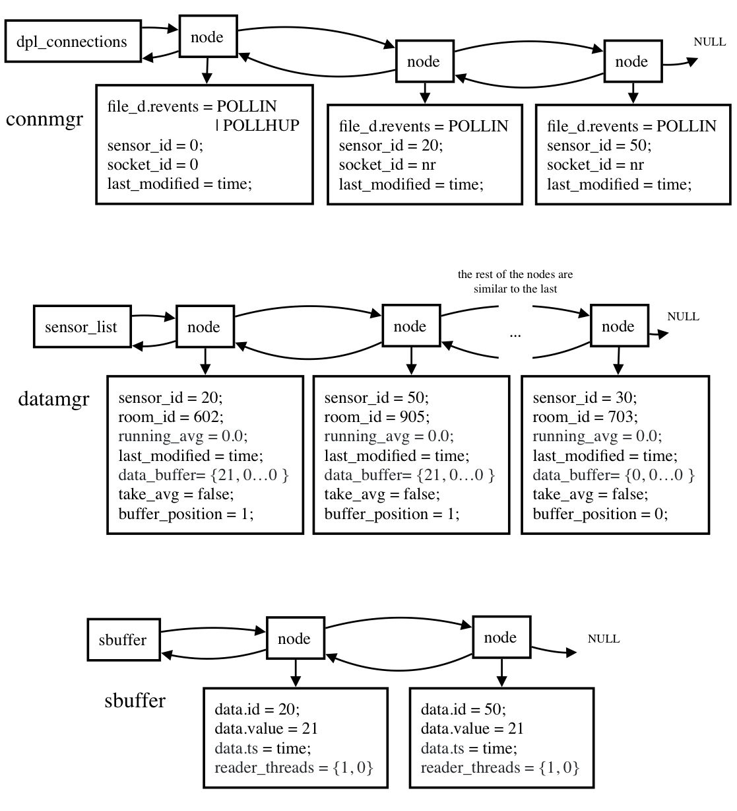

# Sensor Gateway
Part of final project in the course System Software.

The sensor monitoring system consists of sensor nodes measuring the room temperature, a sensor gateway that acquires all sensor data from the sensor nodes, and an SQL database to store all sensor data processed by the sensor gateway. A sensor node uses a private TCP connection to transfer the sensor data to the sensor gateway. The SQL database is an SQLite system. 
Sensor nodes are simulated in software.

The full system is depicted below:

Example of how the heap would look like:

## Todo
The Log Process needs some work.